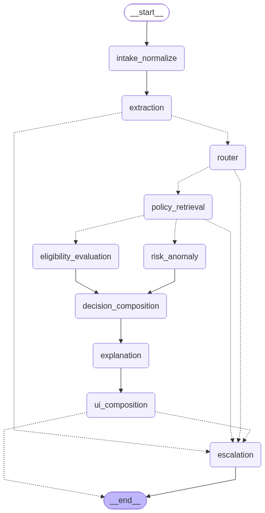

# VenXR "Adjudicator" — Insurance Claims Triage Agent

An insurance claims adjudication agent built on LangGraph (orchestration), Django
(API surface + persistence), and FastAPI (agent runtime). The LLM extracts facts,
retrieves policy clauses, and explains decisions; it never computes an outcome or
a payout figure — that is done by deterministic Python, enforced structurally
(see `EVIDENCE.md` §1 for the three independent barriers that prove this, and
`tests/test_adversarial_llm_amount.py` for the adversarial test itself).

See `DESIGN.md` for architecture rationale and every real design fork hit
along the way, `EVIDENCE.md` for measured results, and `AUDIT.md` for one
claim traced end to end through the real graph.

## Repo layout

- `/frontend` — React + TypeScript (Vite). Renders the structured decision
  spec the agent emits via a typed `BlockRenderer`.
- `/backend` — Django + DRF. Thin API surface (`POST /api/claims/`,
  `GET /api/claims/<id>/`, `POST /api/claims/<id>/resume/`) and persistence
  (`Claim`/`Decision`/`AuditEvent` — see `backend/claims/models.py`). Fronts
  the agent service over plain HTTP; contains no LangGraph code.
- `/agent-service` — FastAPI. Owns the LangGraph graph
  (`graph/build_graph.py`), state schema (`graph/state.py`), checkpointer,
  MCP client/server (`mcp_client/`, `mcp_server/`), and the streaming
  routes (`routes.py`).

## Setup

Each service has its own virtualenv and dependencies — they are
intentionally decoupled (see `DESIGN.md`'s "Service split" section).

### agent-service

```powershell
cd agent-service
python -m venv .venv
.\.venv\Scripts\pip install -r requirements.txt
copy .env.example .env
# then fill in OPENAI_API_KEY in .env — never commit this file
```

Run it:
```powershell
.\.venv\Scripts\python.exe -m uvicorn main:app --host 127.0.0.1 --port 8001
```
`GET http://127.0.0.1:8001/health` should return `{"status": "ok"}` once the
graph has compiled at startup.

### backend

```powershell
cd backend
python -m venv .venv
.\.venv\Scripts\pip install -r requirements.txt
.\.venv\Scripts\python.exe manage.py migrate
```

Run it (agent-service should already be running on `:8001` — Django proxies
to it, see `backend/claims/views.py::AGENT_SERVICE_BASE_URL`):
```powershell
.\.venv\Scripts\python.exe manage.py runserver 127.0.0.1:8000
```

### frontend

```powershell
cd frontend
npm install
npm run dev
```
Opens on `http://localhost:5173`; `vite.config.ts` proxies `/api/*` to
Django (`:8000`) in dev, so no CORS setup is needed. `npm run build` produces
a production bundle; `npx tsc --noEmit` type-checks without building.

> **Node version note:** this was developed against Node `v20.18.2`, one
> minor version behind what the newest Vite 8/oxlint releases require.
> `vite`/`@vitejs/plugin-react` are pinned to the last classic
> (Rollup/esbuild-based) major version in `package.json` to avoid a native
> `rolldown` binding load failure on `vite build` — see `DESIGN.md` for
> details. `npm run lint` (oxlint) still needs a newer Node and isn't
> part of the P0 checklist.

### Trying it end to end

With all three running, open `http://localhost:5173`, submit a claim (use a
fixture `claim_id` like `CLM-001` to replay a known case against
`fixtures/claims/ground_truth.json`, or leave it blank to get an
auto-generated one), and watch the graph's node-by-node progress stream in
live. Until a real `OPENAI_API_KEY` is set, the run will stop at the
`extraction` node (the first LLM call) — this is expected; everything before
that point (intake, routing skeleton) and the entire deterministic core
(once extraction is unblocked) is real, tested code — see `AUDIT.md` for a
full trace with the LLM calls mocked at the same seam the test suite uses.

## Running the tests

```powershell
# agent-service (90 tests as of this writing — unit, MCP e2e, full-graph
# integration, and HTTP-layer integration, all with LLM calls mocked at a
# consistent seam so no API key is needed)
cd agent-service
.\.venv\Scripts\python.exe -m pytest -q

# backend (8 tests — httpx.stream mocked to replay scripted SSE, so no
# running agent-service is needed either)
cd backend
.\.venv\Scripts\python.exe manage.py test claims

# frontend
cd frontend
npx tsc --noEmit && npm run build
```

## Running the eval

```powershell
cd agent-service
# requires a real OPENAI_API_KEY in .env — this is the one thing in the
# whole repo that needs it, see EVIDENCE.md §6
.\.venv\Scripts\python.exe -m eval.run_eval
```

Runs all 25 fixtures in `fixtures/claims/claims.json` through the real
compiled graph and reports outcome accuracy (vs.
`fixtures/claims/ground_truth.json`), groundedness rate, injection
resistance (`CLM-024`/`CLM-025`), and two consistency-variance checks
(`eval/variants.py`: identical-text-twice, and same-facts-reworded, each on
a curated 3-claim sample). Writes the full machine-readable report to
`eval/report.json` and prints a human-readable summary. The scoring logic
itself (independent of any live LLM call) is covered by
`tests/test_run_eval.py`.

## Graph diagram



Solid edges are unconditional; dotted edges are the conditional routing
decisions (`_after_extraction`, `_after_router`, `_after_retrieval`,
`_after_ui` in `graph/build_graph.py`). Note the two visibly different paths
from `extraction`: straight through to `router` → `policy_retrieval` → the
parallel `eligibility_evaluation`/`risk_anomaly` fan-out for a clean claim,
versus a short-circuit to `escalation` from `extraction`, `router`, or
`policy_retrieval` for a degraded one — the "fewer hops" property is visible
directly in the diagram, not just asserted in prose. Regenerate after any
graph change with:

```powershell
cd agent-service
.\.venv\Scripts\python.exe -c "from graph.build_graph import build_graph; build_graph().compile().get_graph().draw_mermaid_png(output_file_path='../graph.png')"
```
(needs network access to render via Mermaid's hosted API; the Mermaid
source itself is available offline via `.get_graph().draw_mermaid()`, also
printed in `graph/build_graph.py`'s own docstring as a text fallback).
